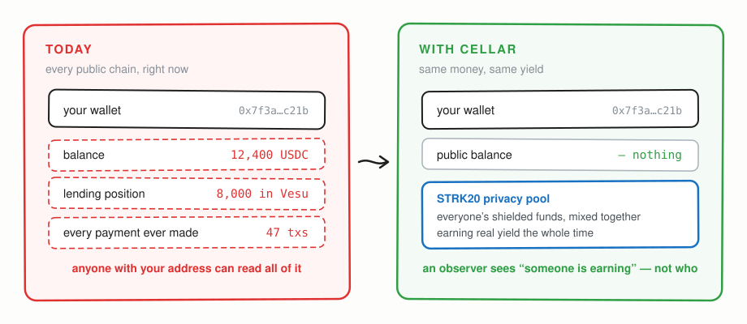
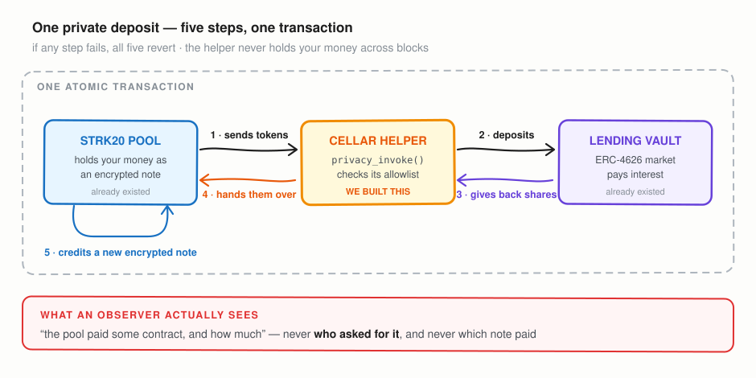
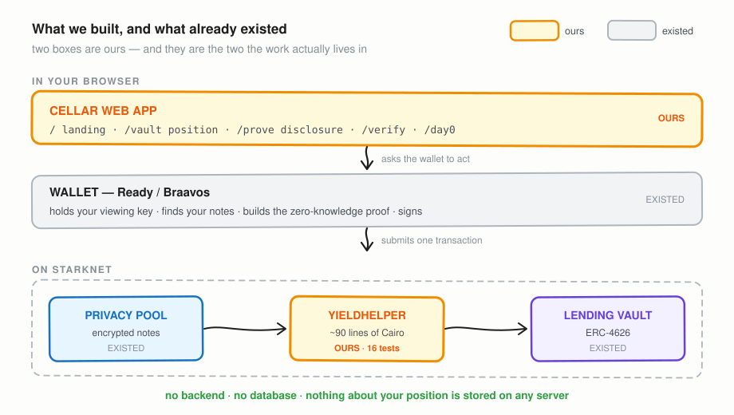

# Cellar

**A private yield account on Starknet.** Shield an asset into the STRK20 privacy pool, route it into a live ERC-4626 lending vault through a custom anonymizer contract, and let the yield accrue back as encrypted notes — so **nothing on-chain links the position to you**, and your solvency stays provable to anyone you choose.

Visible flow, invisible participant. An observer sees that *someone* is earning here. Not that it is you, not what else you hold, and not where you withdraw to.

Built for the [STRK20 Private Sprint](https://strk20.starknet.io/hackathon), against [RFP-24 — Private chain-abstracted yield account](https://strk20.starknet.io/rfp/private-yield-account).

---

## At a glance

**The problem, and what changes.** Today every public chain publishes your
balance, your positions and your whole history to anyone holding your address.



**How one private deposit works.** Five steps inside a single atomic
transaction. If any step fails, all five revert.



**What we actually built.** Two of the boxes are ours — the web app, and the
Cairo anonymizer contract that sits between the privacy pool and a lending
market. Everything else already existed.



---

## The problem

On-chain savings expose everything. Anyone can read your complete balance sheet and DeFi allocation. When positions execute from the same wallet across protocols, observers reconstruct your strategy and front-run it. Deposit and withdrawal addresses stay permanently linked, so the entire path of your capital is a public record.

Bitcoin was invented so value could move without permission or surveillance. Seventeen years later, your balance is a URL anyone can open. Cellar is a small, concrete step at fixing that for yield-bearing positions.

## How it works

Cellar is an **anonymizer contract** — an app-specific Cairo adapter that the STRK20 privacy pool calls atomically. One private deposit is five steps inside a single transaction:

| # | Step |
|---|---|
| 1 | The pool transfers your input tokens to the helper — a plain public transfer, so observers see *the pool paid the helper*, never who asked |
| 2 | The pool calls `privacy_invoke` via the protocol's `INVOKE_SELECTOR` |
| 3 | The helper deposits into (or withdraws from) an allowlisted ERC-4626 vault |
| 4 | The helper **approves** the pool to pull the output — it never transfers |
| 5 | The helper returns `Span<OpenNoteDeposit>`; the pool pulls and credits an encrypted note |

If any step fails, the whole transaction reverts. The helper never holds custody across blocks, never learns who you are, and never touches an encrypted note — it receives plain tokens, does one job, and hands back an instruction.

## What is actually hidden

**Cellar gives you identity privacy for yield actions, not amount privacy.** This distinction is the most important thing on this page, and overclaiming it would be worse than not shipping.

The STRK20 documentation states it directly: *actions routed through anonymizer contracts reveal amounts and timing — identity privacy only.* Cellar routes through an anonymizer, so that applies to every earn and withdraw.

| Hidden | Visible |
|---|---|
| **Who you are.** Nothing links an earn action to your wallet | The amount and timing of each earn or withdraw |
| Your total shielded balance across all notes | Which vault was used, and that the pool paid the helper |
| The link between your deposit and your withdrawal address | Depositor address and amount at the shield step |
| Note amounts and ownership inside the pool | Withdrawal recipient and amount |
| Note-to-note private transfers — **both** amounts and parties | Published nullifiers, unlinkable without a viewing key |

The right mental model is the one prediction markets use: **visible flow, invisible participants.** An observer watching Starknet sees that someone deposited into a Vesu market through Cellar, and how much. They cannot tell it was you, cannot connect it to your other positions, and cannot follow it to where you eventually withdraw.

Further limitations inherited from the pool: tight deposit-and-withdraw timing can correlate, distinctive round amounts are recognisable, and the pool's outer edges are public by design. Cellar does not change any of that, and no privacy tool should claim otherwise.

## Security design

- **No owner, no admin key.** The vault allowlist is written once in the constructor and has no setter. Nobody — including us — can redirect user funds after deployment.
- **Immutable, auditable route.** The vaults a deployed helper may reach are fixed and publicly readable via `allowed_vault_count()` and `allowed_vault_at()`.
- **Output measured by balance delta**, never by the vault's reported return value.
- **No events.** An event here would publish a correlatable trace of an otherwise private action.
- **Approve, never transfer** — the pool pulls, so accounting can't be desynchronised by a rogue push.

## Repository layout

```
contracts/
  src/yield_helper.cairo   the anonymizer — this is what goes to mainnet
  src/mocks.cairo          ERC-20 + ERC-4626 test doubles
  src/tests.cairo          16 tests covering both paths and every guard
app/
  src/lib/strk20.ts        Wallet API integration — actions, u256 split, shadow accounts
  src/lib/wallet.ts        discovery, connection, mainnet guard, capability probe
  src/lib/attest.ts        SNIP-12 attestations, issue + on-chain verify
  src/app/page.tsx         landing — live holdings, chart, diagram, FAQ
  src/components/          PoolChart, FlowDiagram, Faq, SiteHeader
  src/lib/history.ts       anonymity set over time, sampled at historical blocks
  src/app/day0/            Day 0 console
  src/app/vault/           position dashboard
  src/app/prove/           issue a disclosure
  src/app/verify/          public verifier, no wallet needed
config/networks.json       Sepolia + mainnet, verified addresses per chain
docs/ARCHITECTURE.md       the full cycle and design decisions
docs/PRIVACY.md            what is hidden, what is not, and the limits
docs/INTEGRATION.md        Wallet API route, action shapes, the calldata contract
docs/PHASES.md             delivery plan and gates
docs/RUNBOOK.md            step-by-step: wallet, faucet, deploy, verify the claims
scripts/DEPLOY.md          starkli deployment, Sepolia then mainnet
strk20.json                what the sprint panel reads
```

**Never used Starknet?** Follow [RUNBOOK.md](docs/RUNBOOK.md) — wallet, free
testnet tokens, deployment, and how to check every claim yourself.

**Start here otherwise:** [PRIVACY.md](docs/PRIVACY.md) for what Cellar actually
claims, [INTEGRATION.md](docs/INTEGRATION.md) for how it talks to STRK20.

## Quickstart

Requires [Scarb](https://docs.swmansion.com/scarb/) 2.20+ and Node 24+.

```bash
git clone https://github.com/maheepatel/Cellar
cd Cellar/contracts
scarb build
scarb cairo-test
```

Expected: `16 passed; 0 failed`.

App-side crypto tests (SNIP-12 hashing, signature rejection, encoding round trip):

```bash
cd app && npm run test:attest
```

The web app:

```bash
cd app
npm install
npm run dev
```

Then open <http://localhost:5273>. Note `starknet` must resolve to **≥10.4.0** — npm's `latest` tag is 10.0.2, which has no Wallet API at all. The dependency is pinned as `^10.4.0`, which correctly resolves to 10.7.x.

### A note on the test runner

Tests use Cairo's native harness rather than Starknet Foundry, because **starknet-foundry publishes no Windows binary** as of v0.63.0 (macOS and Linux only). The native harness provides `deploy_syscall` and `testing::set_contract_address`, which is enough to exercise the full pool → helper → vault cycle. On macOS or Linux you can additionally run `snforge` against the same contracts.

### Testing without a live Vesu market

Vesu may not be deployed on Starknet Sepolia. `MockVault` is a minimal ERC-4626 stand-in with a `simulate_yield_bps` hook, and the helper cannot tell it apart from the real thing — it only ever calls `deposit`, `withdraw`, `balance_of` and `approve`. Test against the mock on Sepolia, then pass the real Vesu vToken address to the constructor on mainnet.

## Networks

Cellar defaults to **Starknet Sepolia** — it costs nothing, the faucet is open,
and the STRK20 privacy pool is genuinely deployed there. Connecting a wallet on
mainnet switches everything (pool, tokens, RPC, explorer) automatically; there
is no way to read one chain's addresses while signing on another.

| | Sepolia | Mainnet |
|---|---|---|
| Privacy pool | `0x0254a6…cfe0d91` ✅ verified on-chain | `0x040337…ffe812a` |
| Pool activity | ~227k STRK, ~100 ETH shielded | ~1.9M STRK, ~46 ETH |
| RPC | api.cartridge.gg | rpc.starknet.lava.build |
| YieldHelper | _pending — see [DEPLOY.md](scripts/DEPLOY.md)_ | _pending_ |

Note on Sepolia RPCs: Lava, Blast, dRPC and Nethermind all failed when tested
on 4 September 2026. Cartridge answered. Verify any replacement by reading a
block **and** the pool class hash before trusting it.

## Scope

This implements the **MVP defined in RFP-24**: a helper contract managing shielded balances, routing to ERC-4626 lending vaults, with selective disclosure. Disclosure ships as a signed attestation rather than a zero-knowledge proof, and [PRIVACY.md](docs/PRIVACY.md) is precise about the difference.

It deliberately does **not** attempt the full RFP architecture. That description includes Enclave-based confidential routing and private sub-accounts, **neither of which has shipped on Starknet yet**. Building on them today would be building on nothing. When they land, the routing layer is the natural next piece.

## Status

- [x] Anonymizer contract, deposit and withdraw paths
- [x] Immutable vault allowlist, no owner
- [x] Test suite — 11 passing, every protocol constraint covered
- [x] Wallet API integration layer, including shadow-account derivation
- [x] Day 0 console — shield, private transfer, unshield, executed in-app
- [x] Position dashboard — earn, exit, live quote, stealth withdrawal address
- [ ] Sepolia deploy against `MockVault`
- [ ] Three verified mainnet transactions
- [ ] Mainnet deploy against a live ERC-4626 vault
- [x] Selective disclosure — signed threshold attestations + public verifier
- [ ] Demo video

### Open questions blocking Phase 2

1. **Is Vesu deployed on Starknet Sepolia?** If not, the full
   pool → helper → vault round trip cannot be rehearsed before mainnet.
   `MockVault` is the hedge.
2. **Where do Vesu V2 vToken addresses live?** They are not in the published
   contract-addresses page, and the pool's `asset_config` struct has no vToken
   field — V2 externalises them into standalone ERC-4626 vaults.
   `app/scripts/probe-vesu.mjs` dumps any contract's ABI and struct layouts to
   help track one down.

## License

Apache-2.0. See [LICENSE](LICENSE).

## Acknowledgements

Built on [STRK20](https://strk20.starknet.io) by StarkWare. The anonymizer pattern and the Vesu lending helper it adapts are documented at [STRK20 by Example](https://strk20-by-example.org/).
